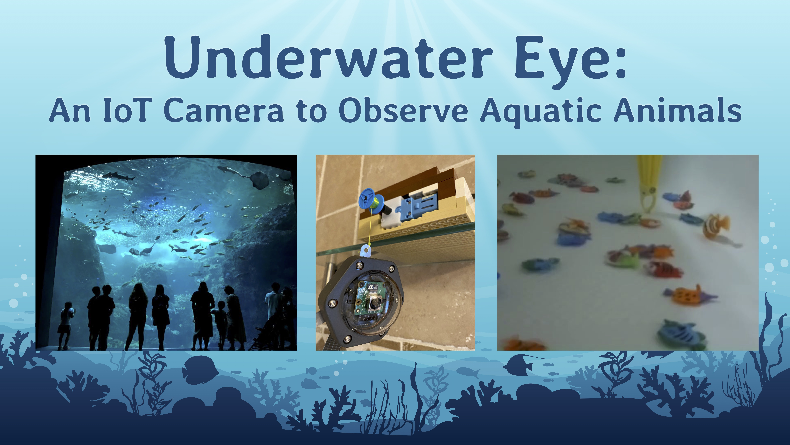

  

This project develops an Internet-of-Things (IoT) device, called Underwater Eye, to operate an underwater camera and observe aquatic animals at an extremely close range. 

Underwater Eye is built with a Raspberry Pi, TT motor, motor driver, camera and waterproof camera case. It runs Python code that drops down a camera slowly to a tank, takes pictures and videos in the tank, pulls up the camera, and uploads the pictures/videos to a cloud database called Kintone. 

This project was submitted to and presented at [AnimalHack 2024](https://animalhack.org/ah24/). 

## Demo

https://github.com/user-attachments/assets/8e6842ac-5c74-42ac-a68b-4f3a1c873b40

https://github.com/user-attachments/assets/c1814a57-3800-44af-96e4-d00cbc174fe5

https://github.com/user-attachments/assets/212d5b15-253d-408c-82de-aec83115785c

https://github.com/user-attachments/assets/0eba6156-9e2c-45d5-bb66-d6bcc8af81f3

